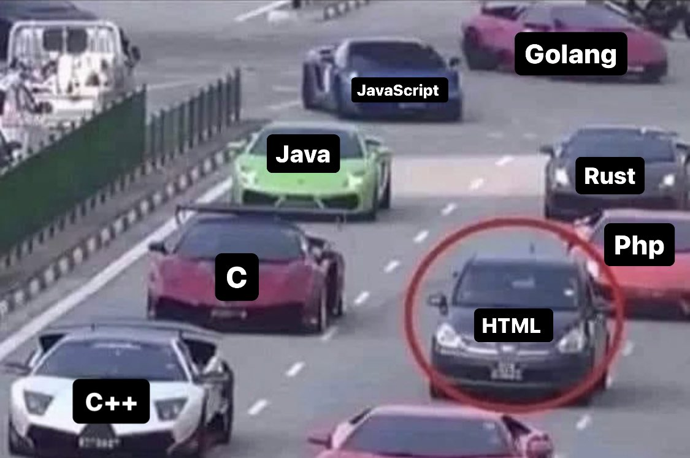

# [Introduction to HTML](https://www.youtube.com/watch?v=ok-plXXHlWw)

HTML is a markup language that defines the structure of your content on the web.

`Hypertext Markup Language`

[HTML Docs - MDN](https://developer.mozilla.org/en-US/docs/Learn/HTML/Introduction_to_HTML)

<!-- ## Now, you know `HTML` -->

<!--  -->

<!-- ## `NOTE:` Not a programming language -->

<!-- ## Just HTML isn't enough as you know by now -->

<!-- ## Okay, i got one more, `NEVER` say that you just know HTML, OR -->

<!--  -->

## HTML in a nutshell

Yup, that's CSS.)

<!--  -->

`P.S.` **NOT** a *Programming Language*.)

## HTML devs in a nutshell.)

`P.S.` Enjoy life, no matter what...

<!-- ### And, `NEVER` say that HTML is a programming language Ever -->

## CSS in a nutshell.)

<!--  -->

Until next time.)
