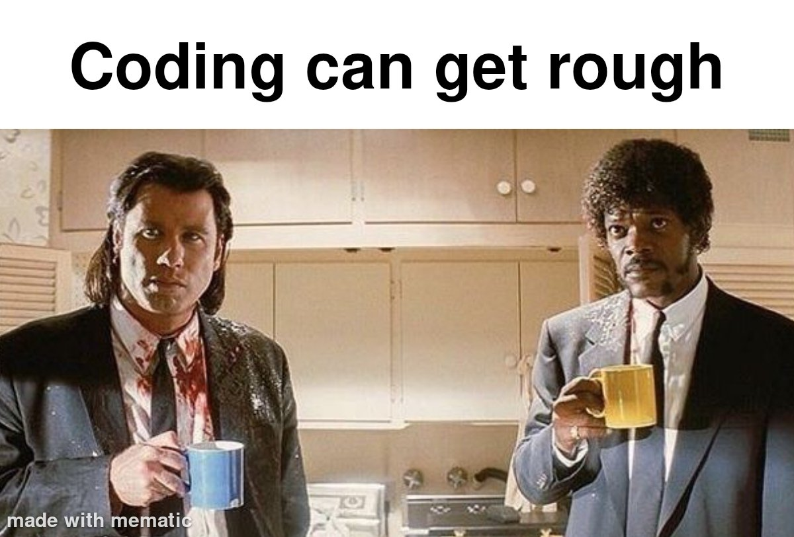

# [🥣 ALGORITHMS](https://en.wikipedia.org/wiki/Algorithm)

Solving basic algorithms with plain JavaScript...


## [➕ Cumulative Sum](https://fireship.io/courses/js/algo-sum/)

- Using **reducer**

```javascript
// reducer
function cumSum(arr) {
    let summed = arr.reduce((acc, curr) => { return acc + curr }, 0)
    return summed;
}

console.log(cumSum(theArray))
```

<!--  -->


- Using **for loop**

```javascript
// for loop
function cumSummed(arr) {
    let summed = 0;
    for (let i = 0; i < arr.length; i++) {
        // console.log(i, summed)
        summed += arr[i];
    }
    return summed
}

console.log(cumSummed(theArray))
```

- Using **forEach**

```javascript
// forEach
function cummedSum(arr) {
    let summed = 0;
    arr.forEach((v) => {summed += v})
    // console.log(summed)      // debugging101 lol ;)
    return summed;
}

console.log(cummedSum(theArray))
```


## [🔪 Binary Search](https://fireship.io/courses/js/algo-binary-search/)

*Binary search* is a faster way to find an item in a sorted array with **O(log n)** time complexity, compared to a regular loop with **O(n)** time complexity.

- An ***efficient** way to find an *item* in a sorted array

- **Divide and Conquer** approach

- [**Time Complexity**](https://en.wikipedia.org/wiki/Time_complexity) of `O(log n)`, **Logarithmic**


- `O(1)` **Constant**, **theBest*
- `O(n)` **Linear**, *Good*
- `O(n log n)` **Logarithmic**, *Fair* Trade
- `O(n^2)` **Quadratic**, *Bad*
- `O(2^n)` **Exponential**, *Horrible*
- `O(n!)` **Factorial**, *Worst*


### Linear Search, `O(n!)`

```javascript
// normal search, O(n!)
function search(arr, target) {
    for (let i = 0; i < arr.length; i++) {
        if(arr[i] === target) {
            return i;
        }
    }
    return -1;
}
```


### [Binary Search](https://en.wikipedia.org/wiki/Binary_search_algorithm), `O(log n)`

```javascript
// lowerCased + sorted
theArray = someArray.map((value) => value.toLowerCase()).sort()

// binarySearch
function binarySearch(arr, target, start = 0, end = arr.length - 1) {

    let pointerIndex = Math.floor((start + end) / 2);
    let indexValue = arr[pointerIndex]
    // console.log(start, end, pointerIndex, indexValue)

    // failed
    if (start > end) {
        console.log('\nNot Found!!')
        return -1;
    }

    // found
    if (indexValue === target) {
        console.log(`${target} found at ${pointerIndex} :)`)
        return pointerIndex;
    }

    // overshoot
    if (indexValue > target) {
        return binarySearch(arr, target, start, pointerIndex - 1)
    }

    // undershoot
    if (indexValue < target) {
        return binarySearch(arr, target, pointerIndex + 1, end)
    }
}

console.log(binarySearch(theArray, 'fml'))
```
`Note:` returns the index on the `sorted` array...



`Note:` It's a lifelong journey...

## [🧺 Least Recently Used (LRU) Cache](https://fireship.io/courses/js/algo-lru/)

Frequently used in the real world for cache n' stuff...

```javascript
class LRU {
    constructor(max) {
        this.max = max;
        this.cache = new Map();     // ordered keys
    }

    getItem(key) {
        let item = this.cache.get(key)      //Map()

        if (item) {
            this.cache.delete(key)
            this.cache.set(key, item)
        }

        return item;
    }

    putItem(key, item) {
        if (this.cache.has(key)) {
            this.cache.delete(key);
        }

        if (this.cache.size == this.max) {
            this.cache.delete(this.oldestItem)      //no `()`
        }

        this.cache.set(key, item)
    }

    // `getter` so you don't have todo `()` when calling.
    get oldestItem() {
        return this.cache.keys().next().value;      //Map()
    }

    debug() {
        // console.log(this.max)
        console.log(this.cache)

        return this.max;
    }

}


cache = new LRU(9);

cache.putItem('Starboy', 3)
console.log(cache.getItem('Starboy'))

// console.log(cache.debug())
```

`Note:` It ain't that tough, you just gotta focus like this...

<!--  -->

## [🧪 `TDD` with `Vitest`](https://fireship.io/courses/js/algo-vitest/)

Test Driven Development

- better confidence with testing


## untilNextTime...

## ;)

- [X] Cumulative Sum
- [X] Binary Search
- [X] LRU Cache
- [ ] TDD
