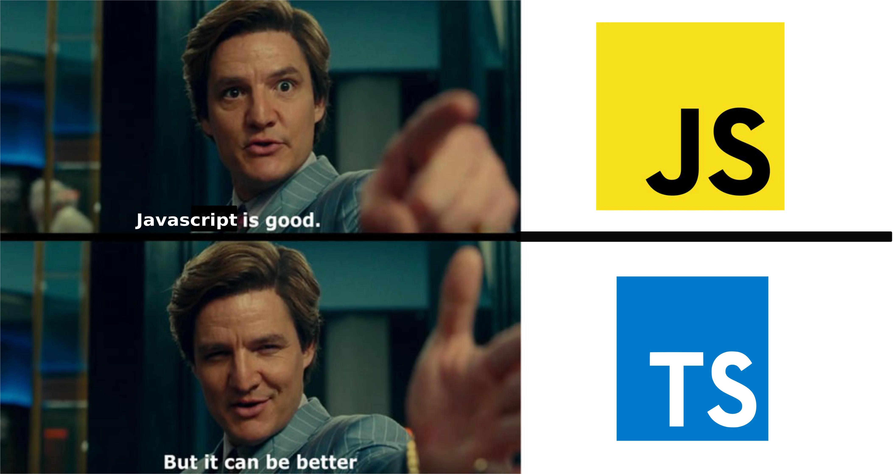

# [Introduction to TypeScript](https://www.youtube.com/watch?v=zQnBQ4tB3ZA)



TypeScript is a strict superset of **JavaScript**.

[TypeScript Docs](https://www.typescriptlang.org/docs/)

## Main Features

- Catch errors before runtime!
- Static Typing
- Interfaces

## Install TypeScript

```shell
npm install -g typescript
```

## TypeScript Version

```shell
tsc --version
```

## Run TypeScript Compiler

It **compiles** to plain **JavaScript**.

```shell
tsc fileName.ts
```

## Until next time...

## ;)
