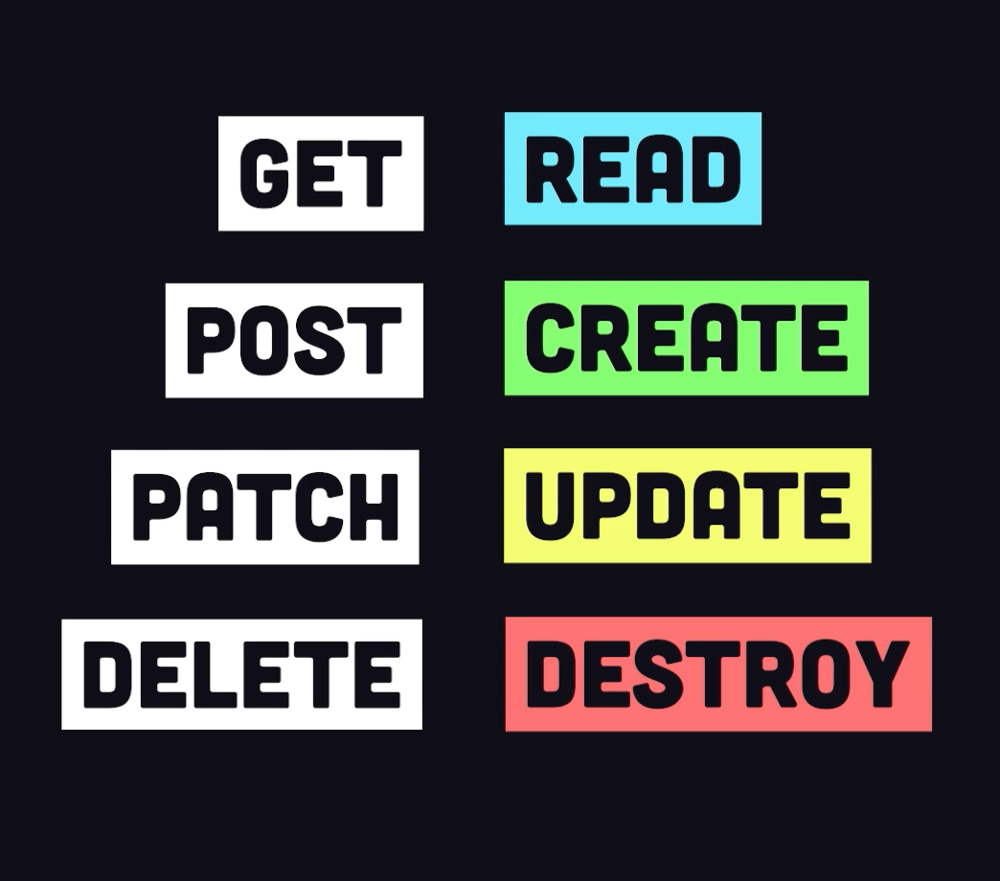

# theDreamProject

A simple *fullstack* image generation application with OpenAI's DALL.E


## 🧙‍♂️ Initial Setup

Scaffold the project

```javascript
npm create @vite-pwa/pwa@latest
```

`Note:` Using *vite* instead of *vanilla*!

## 💤 RESTful APIs

The HTTP *request-response* cycle.

- REST (*representational state transfer*)



### Some *other* methods


### Server responses


## 🤖 Text-to-Image Server

Node.js, Express, and OpenAI

- Store the API key in a file named `.env` (*.gitignore*)

2

